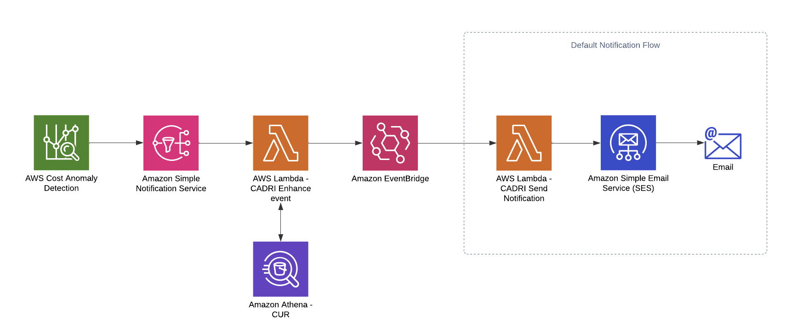

# AWS Cost Anomaly Detection Resource Insight (AWS CADRI)

AWS Cost Anomaly Detection Resource Insight (AWS CADRI) processes events generated by AWS Cost Anomaly Detection and enhances them with information about the top resource IDs contributing to the detected anomaly. This helps you clearly pinpoint the root cause by identifying the specific resources responsible for the cost spike.

## Architecture

> The resources included in the Default Notification Flow will be deployed only if you select **'Yes'** for the **DefaultNotificationFlow** parameter during the CloudFormation stack deployment.

## Prerequisites

AWS CADRI works with the Data exports in AWS Cost and Usage Report (CUR) 2.0 as well as Legacy CUR formats. If you haven't configured the AWS CUR and set up the data catalog table to access the CUR data, please follow the steps outlined in this [link](/Prerequisite.md).

## Getting started

To get started with AWS CADRI, follow these steps:

1. **Download the CloudFormation template** → [AWS CADRI CF Template](/src/cf-template/Cost-Anomaly-Detection-Resource-Insight.yml)

2. **Deploy the template to your environment**

    During deployment, provide the following parameters:

    * **AthenaDB:** The name of the data catalog database that contains the table with the Cost and Usage Report.
    * **AthenaTable:** The name of the table with the Cost and Usage Report.
    * **DefaultNotificationFlow:** Select whether to deploy the default notification flow.
    * **Email:** The email address to associate with the SNS topic for the default notification flow.
    * **QueryOutputLocation:** The S3 location to store Athena query results.
    * **CURS3Bucket** The location where the Cost and Usage Report is stored

3. **Save the SNS topic ARN**

    After deploying the template, navigate to the Outputs tab of the newly created CloudFormation stack and save down the ARN of the SNS topic.

4. **Configure a Cost Monitor for AWS Cost Anomaly Detection**

    * The monitor must be of type **AWS Services**.
    * Follow the instructions in this [guide](https://docs.aws.amazon.com/cost-management/latest/userguide/getting-started-ad.html#create-ad-alerts) to set it up.

5. **Create an Alert Subscription**

    * Set the **Alert frequency** to **Individual alerts** and use the SNS ARN saved in Step 3.

## Contribution

We welcome contributions from the community to enhance AWS CADRI. If you encounter any issues, have ideas for improvement, or want to report a bug, please submit a pull request or open an issue in the repository.

See [CONTRIBUTING](CONTRIBUTING.md#security-issue-notifications) for more information.

## License

AWS CADRI is released under the MIT-0 License.